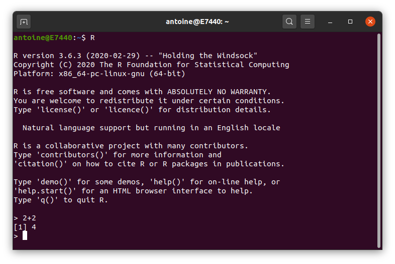

# Introduction à `R`  {#R-intro}


## Introduction

`R` est à la fois un langage de programmation et un logiciel de calcul statistique. Il est *gratuit* et *libre* (*open-source*). Pour commencer, vous allez devoir installer deux logiciels :

1. [`R`, le language de programmation lui même.](https://www.r-project.org)
    - Sélectionnez votre système d'exploitation et choisissez la version la plus récente de `R`
    
1. [RStudio, une excellente interface de programmation pour `R`.](http://www.rstudio.com/)
    - Attention, il faut que vous ayez installé `R` pour pouvoir utiliser RStudio. RStudio est juste une interface permettant d'utiliser `R`.

Les éditeurs du logiciel RStudio ont par ailleurs crée la plate-forme en ligne [RStudio Cloud rstudio.cloud.](https://www.rstudio.cloud). Cette dernière permet d'utiliser `R` en ligne depuis son navigateur, de faire des tutoriels d'introduction (voire plus avancés), etc.  Afin de vous familiariser au plus vite avec le `R` et R Studio (pour ceux qui ne connaissent pas déjà `R`), il faut *au plus vite* que 

1. Vous vous rendiez sur [rstudio.cloud.](https://www.rstudio.cloud) et que vous vous y créiez un compte (*Sign Up*). La plateforme est en anglais mais ça devrait être compréhensible

2. Une fois votre compté crée, allez sur la page des *Primers* (tutoriels d’introduction) : [https://rstudio.cloud/learn/primers](https://rstudio.cloud/learn/primers), et effectuez **au minimum** les tutoriels "*The Basics*" et "*Work with Data*". Idéalement effectuez aussi "*Visualize Data*" et "*Tidy Your Data*". Les plus courageux/motivés pourront également effectuer "*Iterate*" et "*Write Functions*".

R Studio Cloud vous permet également d'utiliser `R` en ligne depuis un navigateur sans avoir à l'installer sur votre machine. C'est extrêmement pratique, mais la version gratuite ne permet que 15 heures d'utilisation par mois pour chaque compte. Son utilisation sera donc réservée aux éventuels cours dans une salle informatique et pour ceux d'entre vous qui sont dans l'impossibilité d'installer `R` sur leur ordinateur.
 
## Démarrer R et R Studio

Il est fondamental de comprendre la différence entre `R`, le langage de programmation, et `RStudio`, l'interface pour `R` qui vous permet de travailler efficacement (et plus facilement) avec `R`.

La meilleure façon de comprendre l'utilité de `RStudio` est de commencer par `R` *sans* `RStudio`. Pour ce faire,  double-clickez sur le programme R que vous devriez avoir installé sur votre ordinateur en suivant les instructions ci-dessus (sous windows ou Mac), ou lancez `R` depuis votre terminal (sous Linux ou Mac) en tapant `R` dans un terminal, voir \@ref(fig:console). Vous venez d'ouvrir la **console** R qui vous permet de commencer à taper du code juste après le symbole  `>`, appelé *prompt*. Essayez de taper `2 + 2` or `print("Votre Nom")` puis appuyez sur la touche Entrée. Et voilà, votre première commande `R`

```{r, logo, fig.cap="Le logo de R" ,fig.align='center',out.width="50%",echo=FALSE}
knitr::include_graphics("images/RLogo.png")
```

``` {r, console, fig.cap="Un terminal R sous Linux",fig.align='center',out.width="50%",echo=FALSE}

```
Taper une commande après l'autre dans la console n'est pas très pratique au fur et à mesure que notre analyse devient plus complexe. L'idéal serait de rassembler toutes les instructions de commande dans un fichier et de les exécuter l'une après l'autre, automatiquement. Nous pouvons le faire en écrivant des fichiers dits **script** , c'est-à-dire de simples fichiers texte avec l'extension `.R` ou `.r` qui peuvent être *insérés* (ou *sourcés*) dans une session `R`. RStudio rend ce processus très simple.

Ouvrez `RStudio` en cliquant sur l'application `RStudio` sur votre ordinateur, et remarquez à quel point l'environnement entier est différent de la console `R` de base - en fait, cette console `R` fonctionne dans votre panneau inférieur gauche. Le panneau supérieur gauche est un espace où vous pouvez écrire des scripts, c'est-à-dire de nombreuses lignes de codes que vous pouvez exécuter quand vous le souhaitez. Pour exécuter une seule ligne de code, il suffit de la mettre en surbrillance et d'appuyer sur "Ctrl" + "Entrée".


RStudio dispose d'un grand nombre de raccourcis clavier utiles. Une liste de ceux-ci peut être trouvée en utilisant un raccourci clavier -- le raccourci clavier qui permet de tous les utiliser :

- Sous Windows ou linux: `Alt` + `Shift` + `K`
- Sous Mac:  `Option` + `Shift` + `K`

L'équipe de `R Studio` a développé [un certain nombre de "cheatsheets"] (https://www.rstudio.com/resources/cheatsheets/) pour travailler à la fois avec `R` et `R Studio`. Cette fiche particulière pour la base `R`] (http://www.rstudio.com/wp-content/uploads/2016/05/base-r.pdf) résume un grand nombre des concepts de ce document.

### Un premier glossaire

* `R` : un langage de programmation statistique
* `R Studio` : un environnement de développement intégré (IDE) pour travailler avec `R`.
* *commande* : saisie de l'utilisateur (texte ou chiffres) que `R` *comprend*.
* *script* : une liste de commandes rassemblées dans un fichier texte, chacune étant séparée par une nouvelle ligne, à exécuter l'une après l'autre.

## Calculs de base

Pour commencer, nous utiliserons le `R` comme une simple calculatrice. Exécutez le code suivant soit directement depuis votre console RStudio, soit dans RStudio en l'écrivant dans un script et en l'exécutant en utilisant "Ctrl" + "Entrée".


#### Addition, Sousraction, Multiplication et Division {-}

| Math          | code `R`    | Résultat    |
|:-------------:|:-------:|:---------:|
| $3 + 2$       | `3 + 2` | `r 3 + 2` |
| $3 - 2$       | `3 - 2` | `r 3 - 2` |
| $3 \cdot2$    | `3 * 2` | `r 3 * 2` |
| $3 / 2$       | `3 / 2` | `r 3 / 2` |

#### Exposants  {-}

| Math          | code `R`    | Résultat    |
|:-------------:|:-------:|:---------:|
| $3^2$        | `3 ^ 2`         | `r 3 ^ 2`         |
| $2^{(-3)}$   | `2 ^ (-3)`      | `r 2 ^ (-3)`      |
| $100^{1/2}$  | `100 ^ (1 / 2)` | `r 100 ^ (1 / 2)` |
| $\sqrt{100}$ | `sqrt(100)`     | `r sqrt(100)`     |


#### Constantes mathématiques   {-}

| Math          | code `R`    | Résultat    |
|:------------:|:---------------:|:-----------------:|
| $\pi$        | `pi`            | `r pi`            |
| $e$          | `exp(1)`        | `r exp(1)`        |

#### Logarithmes  {-}

Notez que nous utiliserons $\ln$ et $\log$ de manière interchangeable pour désigner le logarithme naturel. Il n'y a pas de `ln()` dans `R`, mais on utilise `log()` pour désigner le logarithme naturel.

| Math          | code `R`    | Résultat    |
|:------------:|:---------------:|:-----------------:|
| $\log(e)$         | `log(exp(1))`       | `r log(exp(1))`       |
| $\log_{10}(1000)$ | `log10(1000)`       | `r log10(1000)`       |
| $\log_{2}(8)$     | `log2(8)`           | `r log2(8)`           |
| $\log_{4}(16)$    | `log(16, base = 4)` | `r log(16, base = 4)` |

#### Trigonometrie  {-}

| Math          | code `R`    | Résultat    |
|:------------:|:---------------:|:-----------------:|
| $\sin(\pi / 2)$ | `sin(pi / 2)` | `r sin(pi / 2)` |
| $\cos(0)$       | `cos(0)`      | `r cos(0)`      |

## Obtenir de l'aide

En utilisant `R` comme calculatrice, nous avons vu un certain nombre de fonctions : `sqrt()`, `exp()`, `log()` et `sin()`. Pour obtenir de la documentation sur une fonction dans `R`, il suffit de mettre un point d'interrogation devant le nom de la fonction, ou d'appeler la fonction `help(function)` et RStudio affichera la documentation, par exemple : 

```{r, eval = FALSE}
?log
?sin
?paste
?lm
help(lm)   # help() est équivalent
help(ggplot,package="ggplot2")  # affiche l'aide d'un package  donné
```

Souvent, l'une des choses les plus difficiles à faire quand on apprend `R` est de demander de l'aide. D'abord, vous devez décider de demander de l'aide, puis vous devez savoir *comment* demander de l'aide. Votre toute première ligne de défense devrait être de rechercher sur Google votre message d'erreur ou une brève description de votre problème. (La capacité à résoudre des problèmes à l'aide de cette méthode devient rapidement une compétence extrêmement précieuse). Si cela échoue, et cela finira par arriver, vous devriez demander de l'aide. Il y a un certain nombre de choses que vous devez inclure lorsque vous contactez un enseignant ou que vous postez sur un site d'aide tel que [Stack Overflow] (https://stackoverflow.com).

- Décrivez ce que vous attendez du code.
- Indiquez l'objectif final que vous essayez d'atteindre. (Parfois, ce que vous attendez du code n'est pas ce que vous voulez réellement faire).
- Fournissez le texte intégral de toutes les erreurs que vous avez reçues.
- Fournissez suffisamment de code pour recréer l'erreur. 
- Parfois, il est également utile d'inclure une capture d'écran de toute votre fenêtre RStudio lorsque l'erreur se produit.

Si vous suivez ces étapes, votre problème sera résolu beaucoup plus rapidement, et vous en apprendrez peut-être plus au cours du processus. Ne vous découragez pas en rencontrant des erreurs et des difficultés lors de l'apprentissage de `R`". (Ou toute autre compétence technique.) Cela fait tout simplement partie du processus d'apprentissage.


## Installation de packages

`R` est livré avec un certain nombre de fonctions et d'ensembles de données intégrés, mais l'une des principales forces de `R` en tant que projet open-source est son système de paquets (*packages*). Les paquets ajoutent des fonctions et des données supplémentaires. Souvent, si vous voulez faire quelque chose dans `R`, et que ce n'est pas disponible par défaut, il y a de fortes chances qu'il existe un paquet qui répondra à vos besoins.

Pour installer un paquet, utilisez la fonction `install.packages()`. Imaginez que vous achetez un livre de recettes au magasin, que vous le rapportez à la maison et que vous le mettez sur votre étagère (c'est-à-dire dans votre bibliothèque) :

```{r, eval = FALSE}
install.packages("ggplot2")
```

Une fois qu'un paquet est installé, il doit être chargé dans votre session `R` avant d'être utilisé. Cela revient à retirer le livre de l'étagère et à l'ouvrir pour le lire.

```{r, message = FALSE, warning = FALSE}
library(ggplot2)
```

Une fois que vous fermez `R`, tous les paquets sont fermés et remis sur l'étagère imaginaire. La prochaine fois que vous ouvrirez `R`, vous n'aurez pas à réinstaller le paquet, mais vous devrez charger tous les paquets que vous avez l'intention d'utiliser en invoquant `library()`.

## `Code` et sortie dans ce document {#code-output}

Pour distinguer visuellement le code `R` de sa sortie,  toutes le lignes de sortie commencent par `##`. Un bout de code typique avec sa sortie va ressembler à ça : 
```{r}
1 + 3 
# tout ce qui se situe après un # est un commentaire, R ne l'exécute pas
```

où vous voyez sur la première ligne le code `R`, et sur la deuxième ligne la sortie. Comme mentionné, cette ligne commence par `##` pour dire *c'est une sortie*, suivi par `[1]` (indiquant qu'il s'agit d'un vecteur de longueur *un* - plus d'informations ci-dessous !), suivi par le résultat réel - `1 + 3 = 4` !

Notez que vous pouvez simplement copier et coller tout le code que vous voyez dans votre console `R`. En fait, vous êtes *fortement* encouragé à le faire et à essayer **tout le code** que vous voyez dans ce livre.


## Types de données {#data-types}

`R` a un certain nombre de *types de données* de base. Il est utile de savoir quels types de données sont à votre disposition :

- Numérique
    - Aussi connu sous le nom de Double. Le type par défaut lorsqu'il s'agit de chiffres.
    - Exemples : `1`, `1.0`, `42.5`
- Entier
    - Exemples : `1L`, `2L`, `42L`.
- Complexe
    - Exemple : `4 + 2i`.
- Logique
    - Deux valeurs possibles : `TRUE` et `FALSE`
    - Vous pouvez également utiliser les lettres `T` et `F`, mais cela n'est pas recommandé.
    - `NA` est également considéré comme logique.
- Caractère
    - Exemples : `"a"`, `"Statistiques"`, `"1 plus 2"`.
- Catégorique ou `factor`.
    - Un mélange d'entier et de caractère. Une variable `factor` attribue un label à une valeur numérique.
    - Par exemple, `factor(x=c(0,1),labels=c("homme", "femme"))` assigne la chaîne *homme* aux valeurs numériques `0`, et la chaîne *femme* à la valeur `1`. 

## Structures de données

<!-- `R` a également un certain nombre de  *structures* de données de base. Une structure de données est soit homogène (tous les éléments sont du même type de données), soit hétérogène (les éléments peuvent être de plusieurs types de données). -->

| Dimension | **Homogène** | **Hétérogène** |
|:---------:|:---------------:|:-----------------:|
| 1         | Vector          | List              |
| 2         | Matrix          | Data Frame        |
| 3+        | Array           |    nested Lists               |


### Vecteurs

De nombreuses opérations en `R` font un usage intensif de **vecteurs**. Un vecteur est un *conteneur* pour les objets de type identique (voir \@ref(data-types) ci-dessus). Les vecteurs dans `R` sont indexés à partir de `1`. C'est ce que le `[1]` dans la sortie indique, que le premier élément de la ligne affichée est le premier élément du vecteur. Les plus grands vecteurs afficheront des lignes supplémentaires avec quelque chose comme `[7]` où `7` est l'indice du premier élément de cette ligne.

La façon la plus courante de créer un vecteur en `R` est sans doute d'utiliser la fonction `c()`, qui est l'abréviation de "combine". Comme son nom l'indique, elle combine une liste d'éléments séparés par des virgules. 

```{r}
c(1, 3, 5, 7, 8, 9)
```

Ici, `R` produit simplement ce vecteur. Si nous voulons stocker ce vecteur dans une **variable**, nous pouvons le faire avec l'opérateur **assignation** `<-`. Dans ce cas, la variable `x` contient maintenant le vecteur que nous venons de créer, et nous pouvons accéder au vecteur en tapant `x`.

```{r}
x <- c(1, 3, 5, 7, 8, 9)
x
```


Parce que les vecteurs doivent contenir des éléments qui sont tous du même type, `R` va automatiquement **coercer** (c'est-à-dire convertir) vers un seul type lorsqu'on essaie de créer un vecteur qui combine plusieurs types.

```{r}
c(42, "Statistiques", TRUE)
c(42, TRUE)
```

Il est fréquent que vous souhaitiez créer un vecteur basé sur une séquence de nombres. La façon la plus rapide et la plus simple de le faire est d'utiliser l'opérateur `:`, qui crée une séquence d'entiers entre deux entiers spécifiés.

```{r}
(y <- 1:100)
```

Ici, nous voyons `R` marquer les lignes après la première, car il s'agit d'un grand vecteur. Nous voyons également qu'en mettant des parenthèses autour de l'affectation, `R` stocke le vecteur dans une variable appelée `y` et sort automatiquement `y` vers la console.

Notez que les scalaires n'existent pas dans `R`. Ce sont simplement des vecteurs de longueur `1`.

```{r}
2
```

Si nous voulons créer une séquence qui ne soit pas limitée aux nombres entiers et qui augmente de 1 à la fois, nous pouvons utiliser la fonction `seq()`.

```{r}
seq(from = 1.5, to = 4.2, by = 0.1)
```

Nous discuterons des fonctions en détail plus tard, mais notez ici que les étiquettes d'entrée "from", "to" et "by" sont facultatives.

```{r}
seq(1.5, 4.2, 0.1)
```

Une autre opération courante pour créer un vecteur est `rep()`, qui peut répéter une seule valeur un certain nombre de fois.

```{r}
rep("A", times = 10)
```

La fonction `rep()` peut être utilisée pour répéter un vecteur un certain nombre de fois.

```{r}
rep(x, times = 3)
```

Nous avons maintenant vu quatre façons différentes de créer des vecteurs :

- `c()`
- `:`
- `seq()`
- `rep()`

Jusqu'à présent, nous les avons surtout utilisés de manière isolée, mais ils sont souvent utilisés ensemble.

```{r}
c(x, rep(seq(1, 9, 2), 3), c(1, 2, 3), 42, 2:4)
```

La longueur d'un vecteur peut être obtenue avec la fonction `length()`.

```{r}
length(x)
length(y)
```


#### Exercice 1

1. Créer un vecteur de cinq uns, c'est-à-dire `[1,1,1,1,1,1]`.
1. Remarquez que l'opérateur deux-points `a:b` est juste l'abréviation de *construire une séquence **de** `a` **à** `b`*. Créez un vecteur dont le compte à rebours est de 10 à 0, c'est-à-dire qu'il ressemble à `[10,9,8,7,6,5,4,3,2,1,0]` !
1. la fonction `rep` prend des arguments supplémentaires `times` (comme ci-dessus), et `each`, qui vous indique combien de fois *chaque élément* doit être répété (par opposition au vecteur d'entrée entier). Utilisez `rep` pour créer un vecteur qui ressemble à ceci : `[1 1 1 2 2 2 3 3 3 1 1 1 2 2 2 3 3 3]`

#### Extraire des sous-vecteurs

Pour extraire un sous-vecteur (*subsetting*), c'est-à-dire pour n'en choisir que certains éléments, nous utilisons des crochets, "[]". Nous voyons ici que `x[1]` renvoie le premier élément, et `x[3]` renvoie le troisième élément :

```{r}
x
x[1]
x[3]
```

Nous pouvons également exclure certains indices, dans ce cas le deuxième élément. 

```{r}
x[-2]
```

Enfin, nous voyons que nous pouvons faire des sous-ensembles sur la base d'un vecteur d'indices.

```{r}
x[1:3]
x[c(1,3,4)]
```


Tous les éléments ci-dessus sont des sous-ensembles d'un vecteur utilisant un vecteur d'indices. (Rappelez-vous qu'un seul nombre reste un vecteur) Nous pourrions plutôt utiliser un vecteur de valeurs logiques.

```{r}
z = c(TRUE, TRUE, FALSE, TRUE, TRUE, FALSE)
z
```

```{r}
x[z]
```


`R` est capable d'effectuer de nombreuses opérations sur les vecteurs et les scalaires :

```{r}
x = 1:10 # un vecteur
x + 1 # ajouter un scalaire
2 * x # multiplier tous les éléments par 2
2 ^ x # calculer 2 exposant x 
sqrt(x) # calcule la racine carrée de tous les éléments de x
log(x) # prend le log naturel de tous les éléments en x
x + 2*x # ajouter le vecteur x au vecteur 2x
```

Nous voyons que lorsqu'une fonction comme `log()` est utilisée sur un vecteur `x`, un vecteur est renvoyé qui a appliqué la fonction à chaque élément du vecteur `x`.


### Opérateurs logiques

| Opérateur | Résumé | Exemple | Résultat |
|:---------|:---------------------:|:---------------------:|:-------:|
| `x < y`  | `x` plus petit que `y`                | `3 < 42`               | `r 3 < 42`               |
| `x > y`  | `x` plus grand que `y`             | `3 > 42`               | `r 3 > 42`               |
| `x <= y` | `x` plus petit ou égal à `y`    | `3 <= 42`              | `r 3 <= 42`              |
| `x >= y` | `x` plus grand ou égal à `y` | `3 >= 42`              | `r 3 >= 42`              |
| `x == y` | `x` égal à `y`                  | `3 == 42`              | `r 3 == 42`              |
| `x != y` | `x` pas égal à `y`             | `3 != 42`              | `r 3 != 42`              |
| `!x`     | pas `x`                          | `!(3 > 42)`            | `r !(3 > 42)`            |
| `x | y`  | `x` ou `y`                       | `(3 > 42) | TRUE`      | `r (3 > 42) | TRUE`      |
| `x & y`  | `x` et `y`                      | `(3 < 4) & ( 42 > 13)` | `r (3 < 4) & ( 42 > 13)` |

Dans `R`, les opérateurs logiques marchent également sur les vecteurs :

```{r}
x = c(1, 3, 5, 7, 8, 9)
```

```{r}
x > 3
x < 3
x == 3
x != 3
```

```{r}
x == 3 & x != 3
x == 3 | x != 3
```

C'est très utile pour sélectionner une sous-partie d'un vecteur.

```{r}
x[x > 3]
x[x != 3]
```


```{r}
sum(x > 3)
as.numeric(x > 3)
```

Nous avons vu ici que l'utilisation de la fonction `sum()` sur un tableau de valeurs logiques `Vrai` et `Faux` qui est le résultat de `x > 3` donne un résultat numérique : vous venez de *compter* combien d'éléments de `x`, la condition `> 3` est `Vrai`. Lors de l'appel à `sum()`, `R` est d'abord automatiquement forcé de passer de la logique au numérique où `Vrai` est `1` et `Faux` est `0`. Cette contrainte de logique à numérique se produit pour la plupart des opérations mathématiques.

```{r}
# which(condition sur x) renvoie true/false  
# chaque indice de x où la condition est vraie
which(x > 3)
x [which(x > 3)]

max(x)
which(x == max(x))
which.max(x)
```

#### Exercice 2

1. Créer un vecteur rempli de 10 nombres tirés de la distribution uniforme (indice : utiliser la fonction `runif`) et les stocker dans "x".
1. En utilisant un sous-ensemble logique comme ci-dessus, obtenez tous les éléments de `x` qui sont plus grands que 0,5, et stockez-les dans `y`. 
1. en utilisant la fonction `which`, stockez les *indices* de tous les éléments de `x` qui sont plus grands que 0,5 dans `iy`. 
1. Vérifiez que `y` et `x[iy]` sont identiques. 

### Matrices

`R` peut également être utilisé pour les calculs de **matrice**. Les matrices ont des lignes et des colonnes contenant un seul type de données. Dans une matrice, l'ordre des lignes et des colonnes est important. (Ce n'est pas le cas des *data frames*, que nous verrons plus tard).

Les matrices peuvent être créées à l'aide de la fonction `matrix`. 

```{r}
x = 1:9
x
X = matrix(x, nrow = 3, ncol = 3)
X
```

Remarquez ici que `R` est sensible à la casse (`x` contre `X`).

Par défaut, la fonction `matrice` remplit vos données dans la matrice colonne par colonne. Mais on peut aussi dire à `R` de remplir des lignes à la place :

```{r}
Y = matrix(x, nrow = 3, ncol = 3, byrow = TRUE)
Y
```

Nous pouvons également créer une matrice d'une dimension spécifique où chaque élément est identique, dans ce cas "0".

```{r}
Z = matrix(0, 2, 4)
Z
```

Tout comme les vecteurs, on peut extraire une sous-matrices des crochets, "[]". Cependant, comme les matrices sont bidimensionnelles, nous devons spécifier à la fois une ligne et une colonne lors du sous-ensemble.

```{r}
X
X[1, 2]
```

Ici, nous avons accédé à l'élément de la première ligne et de la deuxième colonne. Nous avons également pu extraire une ligne ou une colonne entière.

```{r}
X[1, ]
X[, 2]
```

Nous pouvons également utiliser des vecteurs pour extraire plus d'une ligne ou d'une colonne à la fois. Dans ce cas, on extrait la première et la troisième colonne de la deuxième ligne :

```{r}
X [2, c(1, 3)]
```

Les matrices peuvent également être créées en combinant des vecteurs sous forme de colonnes, en utilisant `cbind`, ou en combinant des vecteurs sous forme de lignes, en utilisant `rbind`.

```{r}
x = 1:9
rev(x)
rep(1, 9)
```

```{r}
rbind(x, rev(x), rep(1, 9))
```

```{r}
cbind(col_1 = x, col_2 = rev(x), col_3 = rep(1, 9))
```

Lorsque vous utilisez `rbind` et `cbind`, vous pouvez spécifier des noms d'"arguments" qui seront utilisés comme noms de colonnes.

`R` peut alors être utilisé pour effectuer des calculs matriciels

```{r}
x = 1:9
y = 9:1
X = matrix(x, 3, 3)
Y = matrix(y, 3, 3)
X
Y
```

```{r}
X + Y
X - Y
X * Y
X / Y
```

Notez que `X * Y` n'est **pas** une multiplication matricielle. Il s'agit d'une multiplication *élément par élément*. (Pareil pour `X / Y`). 
La multiplication matricielle utilise l'opérateur `%*%`. Les autres fonctions matricielles comprennent `t()` qui donne la transposition d'une matrice et `solve()` qui renvoie l'inverse d'une matrice carrée si elle est inversible.

```{r}
X %*% Y
t(X)
```


#### Exercice 3

1. Créer un vecteur contenant `1,2,3,4,5` appelé v. 
1. Créez une matrice (2,5) `m` contenant les données `1,2,3,4,5,6,7,8,9,10`. La première ligne doit être "1,2,3,4,5".
1. Effectuez la multiplication de la matrice `m` par `v`. Utilisez la commande `%*%`. Quelle est la dimension de la sortie ?
1. Pourquoi la commande`v %*% m` ne fonctionne-t-elle pas ? 


## Data Frames {#dataframes}

Nous avons déjà vu des vecteurs et des matrices pour le stockage des données lorsque nous avons présenté `R`. Nous allons maintenant présenter les **data frame** (bases de données) qui seront la façon la plus courante de stocker et d'interagir avec les données.

```{r}
example_data = data.frame(x = c(1, 3, 5, 7, 9, 1, 3, 5, 7, 9),
                          y = c(rep("Hello", 9), "Goodbye"),
                          z = rep(c(TRUE, FALSE), 5))
```

Contrairement à une matrice, qui peut être considérée comme un vecteur réorganisé en lignes et en colonnes, une *data frame* n'est pas tenue d'avoir le même type de données pour chaque élément. Une *data frame* est une **liste** de vecteurs, et chaque vecteur a un *nom*. Ainsi, chaque vecteur doit contenir le même type de données, mais les différents vecteurs peuvent stocker des types de données différents. Notez, cependant, que tous les vecteurs doivent avoir **la même longueur**.

```{block}
Une **data.frame** est similaire à un tableur habituel. Il y a des *lignes*, et des *colonnes*. Une ligne est généralement considérée comme une *observation*, et chaque colonne est une certaine *variable*, ou *caractéristique* de cette observation.
```

<br>
Regardons la *data frame* que nous venons de créer

```{r}
example_data
```

Là encore, nous accédons à une colonne donnée avec l'opérateur `$` :

```{r}
example_data$x

all.equal(length(example_data$x),
          length(example_data$y),
          length(example_data$z))

str(example_data)

nrow(example_data)
ncol(example_data)
dim(example_data)
names(example_data)
```


### Travailler sur des `data.frames`

La fonction `data.frame()` ci-dessus est une façon de créer une base de données. Nous pouvons également importer des données de différents types de fichiers dans `R`, ainsi qu'utiliser des données stockées dans des paquets.

```{r, echo = FALSE}
write.csv(example_data, "data/example-data.csv", row.names = FALSE)
```

Pour recharger ces données dans `R`, nous utiliserons la fonction `read.csv` :

```{r, message = FALSE, warning = FALSE}
example_data_from_disk = read.csv("data/example-data.csv")
```

```{r}
example_data_from_disk
```

Lorsque nous utilisons des données, il y a généralement trois choses que nous aimerions faire :

- Examiner les données brutes.
- Comprendre les données. (D'où viennent-elles ? Quelles sont les variables ? etc.)
- Visualiser les données.

Pour regarder les données dans un `data.frame`, nous avons deux commandes utiles : `head()` et `str()`.

```{r}
# Nous travaillons avec l'ensemble de données mtcars intégré dans R :
mtcars
```

Vous pouvez voir que cela imprime l'intégralité du data.frame à l'écran. La fonction `head()` affichera les premières `n` observations de la trame de données. 

```{r}
head(mtcars,n=2)
head(mtcars) # défaut
```

La fonction `str()` affichera la "structure" du cadre de données. Elle affichera le nombre d' **observations** et de **variables**, énumérera les variables, donnera le type de chaque variable, et montrera certains éléments de chaque variable. Ces informations peuvent également être trouvées dans la fenêtre "Environnement" de RStudio.

```{r}
str(mtcars)
```

Dans cet base de données, une observation porte sur un modèle particulier de voiture, et les variables décrivent les attributs de la voiture, par exemple son rendement énergétique ou son poids.

Pour en savoir plus sur l'ensemble de données, nous utilisons l'opérateur `?` pour extraire la documentation relative aux données.

```{r, eval = FALSE}
?mtcars
```

`R` dispose d'un certain nombre de fonctions permettant de travailler et d'extraire rapidement des informations de base à partir de cadres de données. Pour obtenir rapidement un vecteur des noms de variables, nous utilisons la fonction `names()`.

```{r}
names(mtcars)
```

Pour accéder à l'une des variables **en tant que vecteur**, nous utilisons l'opérateur `$`.

```{r}
mtcars$mpg
mtcars$wt
```

Nous pouvons utiliser les fonctions `dim()`, `nrow()` et `ncol()` pour obtenir des informations sur la dimension de la base de données.

```{r}
dim(mtcars)
nrow(mtcars)
ncol(mtcars)
```

Ici `nrow()` est aussi le nombre d'observations, qui dans la plupart des cas est la *taille de l'échantillon*.

La sélection de sous-partie de la base de données  peut fonctionner comme pour les matrices en utilisant des crochets, `[ , ]`. Ici, nous trouvons des véhicules dont le mpg est supérieur à 25 miles par gallon et nous n'affichons que les colonnes `cyl`, `disp` et `wt`.

```{r}
# mpg [condition ligne, condition colonne]
mtcars [mtcars$mpg > 20, c("cyl", "disp", "wt")]
```

Une alternative serait d'utiliser la fonction `subset()`, qui a une syntaxe beaucoup plus lisible.

```{r, eval = FALSE}
subset(mtcars, subset = mpg > 25, select = c("cyl", "disp", "wt"))
```

#### Exercice 5

1. Combien d'observations y a-t-il dans `mtcars` ?
1. Combien de variables ?
1. Quelle est la valeur moyenne de `mpg` ?
1. Quelle est la valeur moyenne de `mpg` pour les voitures de plus de 4 cylindres, c'est-à-dire avec `cyl>4` ?


## Les bases de la programmation en `R`

Dans cette section, nous illustrons quelques concepts généraux liés à la programmation en `R`.

### Variables

Nous avons déjà rencontré le terme de "*variable*"" à plusieurs reprises, mais principalement dans le contexte d'une colonne d'une `data.frame`. En programmation, une variable désigne un "*objet*". Une autre façon de le dire est qu'une variable est un nom ou une *étiquette* pour quelque chose :

```{r}
x <- 1
y <- "roses"
z <- function(x){sqrt(x)}
```

Ici, `x` fait référence à la valeur `1`, `y` contient la chaîne de caractères "roses", et `z` est le nom d'une fonction qui calcule $\sqrt{x}$. Remarquez que l'argument `x` de la fonction est différent du `x` que nous venons de définir. Il est **local** à la fonction et n'affecte pas le `x` défini à lextérieur de la fonction : 

```{r}
x
z(9)
```


### Contrôle du flux, conditions "si, alors"

Le contrôle de flux d'execution concerne les moyens par lesquels vous pouvez adapter votre code à différentes circonstances. Si une "condition" est `TRUE`, votre programme fera une chose, et sinon une autre. C'est ce que l'on appelle une déclaration "if/else". Dans `R`, la syntaxe if/else est :

```{r, eval = FALSE}
if (condition = TRUE) {
  un peu de code R
} else {
  un autre code R
}
```

Par exemple,

```{r}
x <- 1
y <- 3
if (x > y) { # test si x > y
  # si VRAI
  z <- x * y
  print("x est plus grand que y")
} else {
  # si FAUX
  z <- x + 5 * y
  print("x est inférieur ou égal à y")
}

z
```


### Boucles

Les boucles sont un élément de programmation très important. Comme son nom l'indique, dans une *boucle*, la programmation passe en boucle **de façon répétée** sur un ensemble d'instructions, jusqu'à ce qu'une condition lui dise de s'arrêter. Par ailleurs, le programme peut *savoir combien d'étapes* il a déjà effectuées - ce qui peut être important à savoir pour de nombreux algorithmes. La syntaxe d'une boucle `for` (il en existe d'autres) est

```{r eval=FALSE}
for (ix in 1:10){ # ne doit pas nécessairement être 1:10 !
  # corps de la boucle : est exécuté à chaque fois
  # la valeur de ix change à chaque itération
}
```

Par exemple, considérons cette simple boucle `for`, qui va simplement imprimer la valeur de l'*itérateur* (appelé `i` dans notre cas) à l'écran :

```{r}
for (i in 1:5){
  print(i)
}
```

Remarquez qu'au lieu de "1:5", nous pourrions avoir *n'importe quelle* sorte de collection d'éléments sur lesquels itérer :

```{r}
for (i in c("mangues", "bananes", "pommes")){
  print(paste("J'aime les",i))  # la fonction de collage "paste" colle les chaînes de caractères
}
```

Nous pouvons "aussi souvent également utiliser des boucles *emboîtées*, qui sont exactement ce que leur nom suggère :

```{r}
for (i in 2:3){
  # premier niveau : pour chaque i
  for (j in c("mangues", "bananes", "pommes")){
    # deuxième niveau : pour chaque j
    print(paste("Puis-je avoir",i,j, "s'il vous plaît ?"))
  }
}
```

Ce qu'il est important de remarquer ici, c'est que vous pouvez faire des calculs avec les itérateurs *tout en restant dans une boucle*. 

```{r}
for (i in 1:4) {
  for (j in 1:4) {
    ifoisj <- i*j
    print(paste(i,"fois",j,"=",ifoisj))
  }
  
}
```

Les *Primers* de rstudio.cloud contiennent un tutoriel sur les boucles qui va au delà de cette brève introduction, et introduite de nouveaux outils

### Fonctions

Jusqu'à présent, nous avons utilisé des fonctions, mais nous n'avons pas vraiment discuté de certains de leurs détails. Une fonction est un ensemble d'instructions que `R` exécute pour nous, un peu comme celles qu'on écrit dans un script. L'avantage est que les fonctions sont beaucoup plus flexibles que les scripts, car elles peuvent dépendre d'arguments *en entrée*, qui modifient le comportement de la fonction. Voici comment définir une fonction :

```{r eval=FALSE}
nom_de_la_fonction <- function(arg1,arg2=valeur_par_défaut){
  # corps de la fonction
  # faire des choses avec arg1 et arg2
  # vous pouvez avoir un nombre illimité d'arguments, avec ou sans défaut
  # Toute commande "R" valide peut être incluse ici
  # la dernière ligne est renvoyée comme résultat de la fonction
}
```

Et voici un exemple trivial de définition d'une fonction :

```{r}
bonjour <- function(votre_nom = "Lord Vader"){
  paste("Bienvenue,",votre_nom)
  # nous pourrions aussi écrire :
  # return(paste("Bienvenue,",votre_nom))
}
# nous appelons la fonction en tapant son argument entre parenthèses
bonjour()
```
Vous voyez qu'en ne spécifiant pas l'argument `votre_nom`, `R` utilise à la valeur par défaut donnée. Essayez avec votre propre nom maintenant ! 

Le simple fait de taper le nom de la fonction (sans parenthèses) nous renvoie sa définition, ce qui est parfois pratique :

```{r}
bonjour
```

Il est instructif de considérer qu'avant de définir la fonction "bonjour" ci-dessus, `R` ne savait pas quoi faire, si vous aviez appelé `bonjour`. La fonction n'existait pas ! En ce sens, nous avons appris à `R` un nouveau truc. Cette fonction permettant de créer de nouvelles capacités en plus d'un langage de base est l'une des caractéristiques les plus puissantes des langages de programmation. En général, il est bon de diviser votre code en plusieurs petites fonctions, plutôt qu'en un long fichier de script. Cela rend votre code plus lisible, et il est plus facile de repérer les erreurs.


Les *Primers* de rstudio.cloud contiennent un tutoriel sur les fonctions qui vous permettra d'aller plus loin sur ce thème.

#### Exercice 6

1. Écrivez une boucle qui compte à rebours de 10 à 1, en imprimant la valeur de l'itérateur à l'écran.
1. Modifiez cette boucle pour écrire "plus que i itérations" où "i" est l'itérateur
1. Modifiez cette boucle de manière à ce que chaque itération dure environ une seconde. Vous pouvez y parvenir en ajoutant la commande `Sys.sleep(1)` sous la ligne qui affiche "plus que i itérations". 


